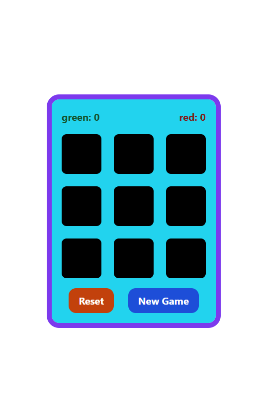

# 🎮 Tic-Tac-Toe React Game

A modern, responsive, and interactive **Tic-Tac-Toe** game built with **React** and **Tailwind CSS**.  
It includes game logic for turns, winner detection, draw states, and persistent score tracking.

---

🚀 Live Demo

👉 https://github.com/ahmednabil22224/Tic-Tac-Toe

---

## 🚀 Features

✅ **Real-time gameplay** — take turns playing as green (X) or red (O)  
✅ **Automatic winner detection** with animated line indicators  
✅ **Draw detection** when all squares are filled  
✅ **Score tracking** for each player  
✅ **New game reset** without reloading the page  
✅ **Responsive design** — works on mobile, tablet, and desktop  
✅ **Built with reusable components** (`Square`, `FullSquares`, `Winner`)

---

## ⚙️ Technologies Used

| Category           | Technology                                       |
| ------------------ | ------------------------------------------------ |
| Frontend Framework | React 18                                         |
| Styling            | Tailwind CSS                                     |
| Icons              | React Icons (`react-icons/fa`, `react-icons/rx`) |
| State Management   | React Hooks (`useState`, `useEffect`)            |

---

## 🗂️ Project Structure

```

my-app/
│
├── src/
├── App.js # Main game logic & layout
├── FullSquares.js # Renders the full grid & arrow animation
├── Square.js # Individual square component
├── Winner.js # Handles score and winner display
├── App.css # Tailwind styling & custom animations
├── index.js # React app entry point
│
├── images/
│   ├── screenshot.png
│   └── lighthouse.png
│
├── README.md
└── package.json


```

---

## 📸 Screenshots



## 🚀 How to Run Locally

1. Clone this repository:

   ```bash
   git clone https://github.com/ahmednabil22224/Tic-Tac-Toe.git

   ```

2.Install dependencies

npm install

3.⚠️ Start the development server

npm start

4.Open your browser

http://localhost:3000

---

## 🌟 Lighthouse Report

| Metric            | Score |
| ----------------- | ----- |
| ⚡ Performance    | 96%  |
| ♿ Accessibility  | 100%   |
| 🛡️ Best Practices | 100%  |
| 🔍 SEO            | 100%  |

images/lighthouse-report.png

## ⚡ Lighthouse Report


---
